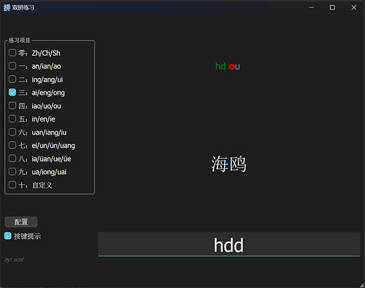

# shuangpin
小鹤双拼练习软件

# 简介

一款小鹤双拼练习软件

## 使用

勾选要练习的项目，点击配置数据，点击开始，即可开始练习

切换/增减项目后，需重新点击配置数据，再点击开始

有一定熟练度的人可以选择关闭按键提示，

## 说明
1. 项目一到九按照常用3500字中韵母的频率排序，可以优先练习高频韵母
2. 每个项目只练习3种拼音的映射，复习频率高，可以起到更好的练习效果
3. 自带词库以词语为单位，相比于练习单字或拼音映射，更符合真实打字场景
4. 自带词库的词只会练习一个映射，如
   
    班级（ban ji）

    只练习an->j的映射，其他按键(b ji)同全拼，而不会出现
   
    手掌（shou zhang）
   
    这样同时要求sh->u ou->z zh->v ang->h多个映射的难词
5. 可以在"/词库"文件夹里修改练习词库，10.txt可自定义练习的词库，支持字、词、成语、句子，但不建议包含标点符号
